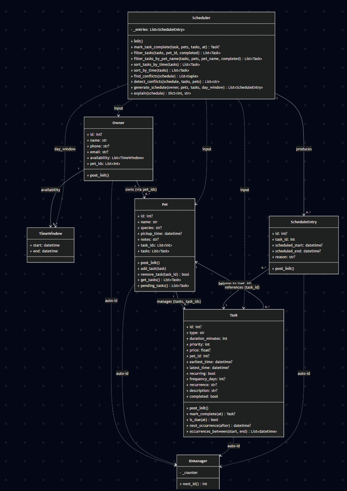
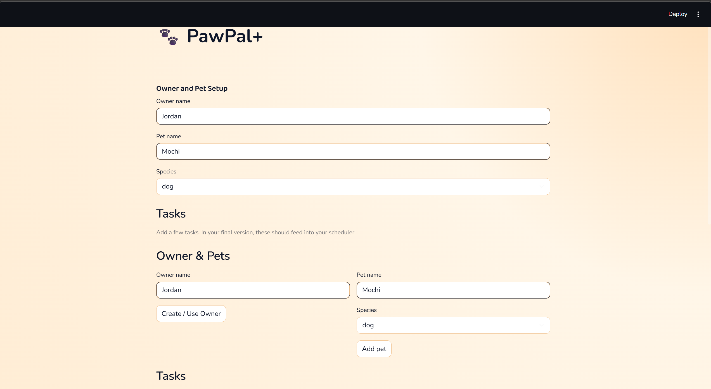

# PawPal+ (Module 2 Project)

**PawPal+** is a Streamlit app for planning daily pet care with scheduling constraints, recurrence support, and explainable outputs.

## Scenario

A busy pet owner needs help staying consistent with pet care. They want an assistant that can:

- Track pet care tasks (walks, feeding, meds, enrichment, grooming, etc.)
- Consider constraints (time available, priority, owner preferences)
- Produce a daily plan and explain why it chose that plan

Your job is to design the system first (UML), then implement the logic in Python, then connect it to the Streamlit UI.

## What This App Does

PawPal+ lets a pet owner:

- Manage owner and pet profiles
- Add tasks with duration, priority, and pet assignment
- Generate a daily plan within a day window
- Show scheduled and unscheduled tasks with reasons
- Surface conflict warnings in the UI

## Features

The feature list below reflects the implemented algorithms in `pawpal_systems.py` and UI integration in `app.py`.

- **Sorting by time**
	Tasks are sorted chronologically using `earliest_time`, with support for `HH:MM` string fallback (`Scheduler.sort_by_time`) and recurring next-occurrence ordering (`Scheduler.sort_tasks_by_time`).
- **Task filtering**
	Tasks can be filtered by pet (ID or pet name) and completion state (`Scheduler.filter_tasks`, `Scheduler.filter_tasks_by_pet_name`).
- **Greedy schedule generation**
	The scheduler performs a first-fit greedy pass over incomplete tasks, enforcing earliest/latest times and optional day-window bounds (`Scheduler.generate_schedule`).
- **Unscheduled reason tracking**
	Tasks that cannot be placed are preserved with explicit reasons like `cannot meet latest_time`, `outside day window`, or conflict metadata.
- **Conflict warnings**
	Overlapping scheduled entries are detected and returned as human-readable warnings (`Scheduler.detect_conflicts`, `Scheduler.find_conflicts`).
- **Daily and weekly recurrence support**
	Recurring tasks support `daily`/`weekly` recurrence or explicit `frequency_days`, with next-task creation on completion (`Task.mark_complete`, `Task.next_occurrence`, `Scheduler.mark_task_complete`).
- **Explainable plan output**
	The scheduler produces explanation text for each schedule entry (`Scheduler.explain`) and the app surfaces this in a dedicated explanation section.
- **Next available slot finder**
	Given a desired duration, the scheduler scans existing schedule entries for the earliest gap that can fit the request within the day window (`Scheduler.find_next_available_slot`). The UI exposes this after schedule generation so owners can quickly find open time for ad-hoc tasks.
- **Auto ID management (internal)**
	IDs are generated automatically across domain entities via `IDManager`, while frontend display keeps IDs hidden for cleaner UX.

## Smarter Scheduling

This project adds several scheduling improvements: tasks can be sorted by next occurrence or an HH:MM string, filtered by pet or completion status, and recurring tasks are expanded lazily. The scheduler detects lightweight conflicts and will warn instead of crashing. Marking recurring tasks complete will automatically create the next occurrence.

## 📸 Demo

Add your final Streamlit screenshot at `assets/pawpal-demo.png`, then this section will render it in GitHub:





Suggested capture: show the Task Board and Today's Plan sections with at least one conflict warning and one scheduled task.

## Getting started

### Setup

```bash
python -m venv .venv
source .venv/bin/activate  # Windows: .venv\Scripts\activate
pip install -r requirements.txt
```

### Suggested workflow

1. Read the scenario carefully and identify requirements and edge cases.
2. Draft a UML diagram (classes, attributes, methods, relationships).
3. Convert UML into Python class stubs (no logic yet).
4. Implement scheduling logic in small increments.
5. Add tests to verify key behaviors.
6. Connect your logic to the Streamlit UI in `app.py`.
7. Refine UML so it matches what you actually built.

## Testing PawPal+

Run the automated tests with:

```bash
python -m pytest
```

Current tests cover core model and scheduler behavior, including:

- Task completion state changes (`Task.mark_complete`)
- Pet/task linkage (`Pet.add_task` and task ID tracking)
- Sorting correctness (tasks returned in chronological order)
- Recurrence logic (daily completion creates a next-day task)
- Conflict detection (duplicate/overlapping scheduled times are flagged)
- Scheduling edge cases (no tasks, missed latest time, outside day window, completed-task filtering, malformed time strings)
- Next available slot finder (gap between entries, after last entry, fully packed schedule, empty schedule)
- JSON persistence round-trip (save and reload preserves owner, pets, tasks with datetimes)
- Loading from a missing file returns safe defaults

Confidence Level: 4/5 stars

Rationale: test results are currently passing and cover core happy paths plus important edge cases, but additional scenarios (for example larger mixed-priority workloads and owner-availability enforcement) would further improve reliability confidence.

## Challenge 1: Advanced Algorithmic Capability via Agent Mode

### Feature: Next Available Slot Finder

The **next available slot finder** (`Scheduler.find_next_available_slot`) is a third algorithmic capability beyond greedy scheduling and conflict detection. Given a requested duration in minutes and the current schedule, it performs a linear scan over sorted schedule entries to locate the earliest contiguous gap that fits the request within the day window.

**Algorithm:** The method sorts scheduled entries by start time, then walks a cursor from the window start through each entry. At each step it checks whether the gap between the cursor and the next entry's start is large enough. After the last entry, it checks the remaining time until the window end. Returns a `TimeWindow` for the first valid slot, or `None` if the schedule is fully packed.

**Use case:** After generating a daily plan, the owner can ask "where can I fit a 30-minute grooming session?" and immediately see the earliest open slot without manually scanning the timeline.

### How Agent Mode Was Used

Claude Code's Agent Mode was used to implement this feature end-to-end:

1. **Codebase analysis** -- Agent Mode read `pawpal_systems.py` and `app.py` to understand the existing `Scheduler` class, `ScheduleEntry` data model, and `TimeWindow` type before writing any code.
2. **Algorithm implementation** -- Agent Mode wrote the `find_next_available_slot` method on the `Scheduler` class, choosing a cursor-based linear scan that reuses the existing `ScheduleEntry` and `TimeWindow` types with no new dependencies.
3. **UI integration** -- Agent Mode added a "Next Available Slot Finder" section to `app.py` that appears after schedule generation, wired to the new method with a duration input and result display.
4. **Test generation** -- Agent Mode added four pytest cases covering: gap between entries, slot after the last entry, fully packed schedule (returns `None`), and empty schedule. All 14 tests pass.
5. **Documentation** -- Agent Mode updated this README with the feature description, test coverage notes, and this Agent Mode usage section.

## Challenge 2: Data Persistence with Agent Mode

### Feature: JSON Save/Load

PawPal+ now persists all owner, pet, and task data to `data.json` so everything survives between app restarts. No external serialization library is needed -- the implementation uses custom dictionary conversion to handle `datetime` fields and nested object graphs.

**How it works:**

- `save_to_json(filepath, owner, pets)` converts Owner, Pet, and Task objects into plain dicts (with `datetime` fields serialized as ISO 8601 strings) and writes them to a JSON file.
- `load_from_json(filepath)` reads the JSON file back, reconstructs all objects, re-links tasks to pets, and advances the `IDManager` counter past any loaded IDs to prevent collisions with new objects.
- `app.py` calls `load_from_json` on first load (session state init) and calls `save_to_json` after every mutation (create owner, add pet, add task).

**Why custom dict conversion instead of marshmallow:** The dataclasses are small and the only non-trivial serialization need is `datetime`. A few helper functions (`_task_to_dict`, `_dict_to_task`, etc.) handle this directly with `datetime.isoformat()` / `datetime.fromisoformat()`, avoiding an extra dependency.

### How Agent Mode Was Used

1. **Serialization strategy** -- Agent Mode analyzed the dataclass fields across `Owner`, `Pet`, and `Task` to identify `datetime` as the only type needing special handling, then chose custom dict conversion over marshmallow to avoid adding a dependency.
2. **Implementation** -- Agent Mode wrote `save_to_json` and `load_from_json` functions in `pawpal_systems.py` with helper converters for each dataclass, including ID counter restoration to prevent duplicate IDs after reload.
3. **App integration** -- Agent Mode updated `app.py` to auto-load from `data.json` on startup and auto-save after every owner/pet/task creation.
4. **Testing** -- Agent Mode added two pytest cases: a full round-trip test (save then load, verify all fields including datetimes) and a missing-file safety test. All 16 tests pass.
