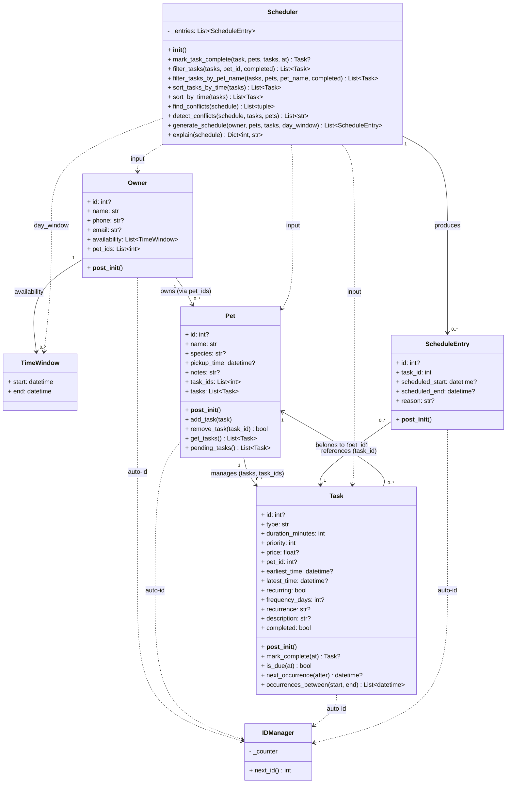

```mermaid
classDiagram
	class IDManager {
		- _counter
		+ next_id() int
	}

	class TimeWindow {
		+ start: datetime
		+ end: datetime
	}

	class Owner {
		+ id: int?
		+ name: str
		+ phone: str?
		+ email: str?
		+ availability: List~TimeWindow~
		+ pet_ids: List~int~
		+ __post_init__()
	}

	class Pet {
		+ id: int?
		+ name: str
		+ species: str?
		+ pickup_time: datetime?
		+ notes: str?
		+ task_ids: List~int~
		+ tasks: List~Task~
		+ __post_init__()
		+ add_task(task)
		+ remove_task(task_id) bool
		+ get_tasks() List~Task~
		+ pending_tasks() List~Task~
	}

	class Task {
		+ id: int?
		+ type: str
		+ duration_minutes: int
		+ priority: int
		+ price: float?
		+ pet_id: int?
		+ earliest_time: datetime?
		+ latest_time: datetime?
		+ recurring: bool
		+ frequency_days: int?
		+ recurrence: str?
		+ description: str?
		+ completed: bool
		+ __post_init__()
		+ mark_complete(at) Task?
		+ is_due(at) bool
		+ next_occurrence(after) datetime?
		+ occurrences_between(start, end) List~datetime~
	}

	class ScheduleEntry {
		+ id: int?
		+ task_id: int
		+ scheduled_start: datetime?
		+ scheduled_end: datetime?
		+ reason: str?
		+ __post_init__()
	}

	class Scheduler {
		- _entries: List~ScheduleEntry~
		+ __init__()
		+ mark_task_complete(task, pets, tasks, at) Task?
		+ filter_tasks(tasks, pet_id, completed) List~Task~
		+ filter_tasks_by_pet_name(tasks, pets, pet_name, completed) List~Task~
		+ sort_tasks_by_time(tasks) List~Task~
		+ sort_by_time(tasks) List~Task~
		+ find_conflicts(schedule) List~tuple~
		+ detect_conflicts(schedule, tasks, pets) List~str~
		+ generate_schedule(owner, pets, tasks, day_window) List~ScheduleEntry~
		+ explain(schedule) Dict~int, str~
	}

	Owner "1" --> "0..*" TimeWindow : availability
	Owner "1" --> "0..*" Pet : owns (via pet_ids)
	Pet "1" --> "0..*" Task : manages (tasks, task_ids)
	Task "0..*" --> "1" Pet : belongs to (pet_id)
	Scheduler "1" --> "0..*" ScheduleEntry : produces
	ScheduleEntry "0..*" --> "1" Task : references (task_id)

	Scheduler ..> Owner : input
	Scheduler ..> Pet : input
	Scheduler ..> Task : input
	Scheduler ..> TimeWindow : day_window

	Owner ..> IDManager : auto-id
	Pet ..> IDManager : auto-id
	Task ..> IDManager : auto-id
	ScheduleEntry ..> IDManager : auto-id
```
